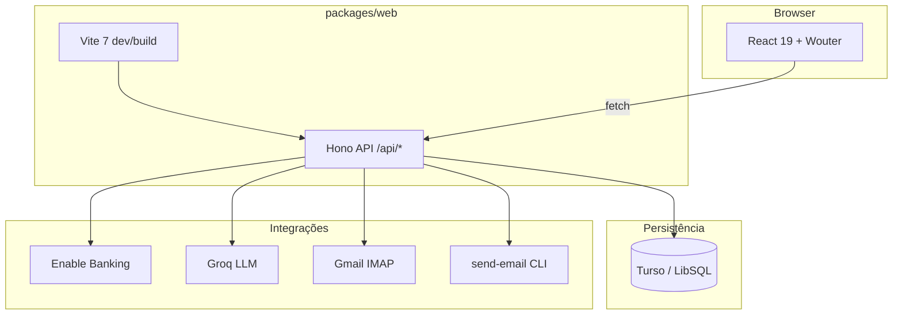

# Arquitectura — Gestão Condomínio (Condominio-7663)

Documento para revisão externa (Gemini, equipa, refatoração).  
Actualizado: 2026-08-22.

---

## 1. Visão geral

**Monorepo Bun** com um único pacote activo: `packages/web`.

**Um processo Vite** serve frontend React e API Hono na porta **4200** (`bun run dev` na raiz).

| Camada | Tecnologia |
|--------|------------|
| Runtime | Bun 1.3.x |
| Backend | Hono 4 (`.basePath("/api")`) |
| Frontend | React 19, Vite 7, Tailwind 4, Wouter |
| BD | Turso / LibSQL (SQLite) + Drizzle ORM |
| Auth | better-auth (admin / condómino) |
| Banco | Enable Banking → Santander Empresas PT |
| LLM | Groq (fallback OpenRouter) |
| Email inbox | IMAP Gmail (`imapflow` + `mailparser`) |
| Email envio | CLI externo `send-email` |
| PDF | Puppeteer |

**Condomínio piloto:** Urbanização da Fonte — config em `packages/web/src/api/lib/condominio.ts`.

**Arquivado (fora do `dev`):** `_archive/mobile`, `_archive/desktop`.

---

## 2. Diagrama



---

## 3. Árvore de directórios

```
Condominio-7663/
├── .env                          # secrets (raiz, não versionado)
├── .env.template
├── package.json                  # workspace root
├── turbo.json
├── run-cron-local.ts
├── README.md
├── docs/
│   └── ARCHITECTURE.md           # este ficheiro
│
├── _archive/                     # mobile/desktop (legado)
│   ├── mobile/
│   └── desktop/
│
└── packages/
    └── web/
        ├── package.json
        ├── vite.config.ts
        ├── drizzle.config.ts
        ├── scripts/              # CLI one-off (seed, import, smoke)
        ├── vite/plugins/
        │   ├── hono-dev-plugin.ts
        │   └── runable-analytics-plugin.ts
        └── src/
            ├── api/              # backend
            │   ├── index.ts        # app Hono + crons no arranque
            │   ├── auth.ts
            │   ├── database/
            │   │   ├── schema.ts
            │   │   ├── auth-schema.ts
            │   │   └── seed-*.ts
            │   ├── middleware/auth.ts
            │   ├── lib/            # lógica de negócio
            │   └── routes/         # routers Hono
            └── web/              # frontend
                ├── app.tsx
                ├── components/
                ├── hooks/
                ├── lib/
                └── pages/
```

---

## 4. package.json — raiz

```json
{
  "name": "sandbox-app-template",
  "private": true,
  "packageManager": "bun@1.3.5",
  "workspaces": ["packages/*"],
  "scripts": {
    "dev": "cd packages/web && bun --env-file=../../.env x vite",
    "build": "turbo build",
    "typecheck": "turbo typecheck",
    "db:generate": "turbo db:generate",
    "db:migrate": "turbo db:migrate",
    "db:push": "turbo db:push",
    "db:studio": "turbo db:studio",
    "cron:local": "bun --env-file=.env run run-cron-local.ts",
    "smoke:db": "cd packages/web && bun --env-file=../../.env run scripts/smoke-db-check.ts"
  },
  "dependencies": {
    "@aws-sdk/client-s3": "^3.1023.0",
    "@libsql/client": "^0.17.2",
    "@noble/hashes": "^2.2.0",
    "cloudflare": "^5.2.0",
    "xlsx": "0.18.5"
  },
  "devDependencies": {
    "@tursodatabase/api": "^1.9.2",
    "@types/bun": "latest",
    "turbo": "^2"
  }
}
```

---

## 5. package.json — packages/web

```json
{
  "name": "@template/web",
  "dependencies": {
    "hono": "^4.12.10",
    "drizzle-orm": "^0.45.2",
    "@libsql/client": "^0.17.2",
    "better-auth": "1.4.22",
    "react": "19.1.0",
    "react-dom": "19.1.0",
    "wouter": "^3.9.0",
    "@tanstack/react-query": "^5.100.6",
    "tailwindcss": "^4.2.1",
    "zod": "^4.3.6",
    "puppeteer": "^25.0.4",
    "imapflow": "^1.7.1",
    "mailparser": "^3.9.15",
    "recharts": "^3.8.1",
    "xlsx": "^0.18.5"
  }
}
```

Lista completa: `packages/web/package.json`.

---

## 6. API — rotas Hono

Montagem em `packages/web/src/api/index.ts`.

| Prefixo | Ficheiro | Domínio |
|---------|----------|---------|
| `/fracoes` | routes/fracoes.ts | Frações e proprietários |
| `/quotas` | routes/quotas.ts | Quotas mensais/extras |
| `/despesas` | routes/despesas.ts | Despesas |
| `/fornecedores` | routes/fornecedores.ts | Fornecedores |
| `/dashboard` | routes/dashboard.ts | KPIs, morosos |
| `/portal` | routes/portal.ts | Portal condómino |
| `/bank`, `/sync/bank` | routes/bank.ts | Enable Banking |
| `/bank-movements` | routes/bank-movements.ts | Movimentos bancários |
| `/recibos` | routes/recibos.ts | Recibos PDF |
| `/avisos` | routes/avisos.ts | Avisos de cobrança |
| `/relatorio` | routes/relatorio.ts | Relatórios mensais |
| `/identity` | routes/identity.ts | Matriz de identidade |
| `/import` | routes/import.ts | Import CSV |
| `/atas` | routes/atas.ts | Atas e votação |
| `/reunioes` | routes/reunioes.ts | Reuniões, STT, áudio |
| `/tickets` | routes/tickets.ts | Pedidos portal ↔ admin |
| `/email-inbox` | routes/email-inbox.ts | Inbox Gmail + triagem LLM |
| `/admin-users` | routes/admin-users.ts | Utilizadores |
| `/configuracoes` | routes/configuracoes.ts | Configurações |
| `/setup`, `/seed` | routes/setup.ts, seed.ts | Setup inicial |

Auth: `better-auth` em `/api/auth/*`; resto protegido por `authMiddleware` + `requireAdmin` onde aplicável.

---

## 7. Crons e side effects no arranque

Definidos em `packages/web/src/api/index.ts`:

| Job | Quando | Condição |
|-----|--------|----------|
| Rehydrate dívidas | Arranque | sempre |
| Bank sync | Arranque + 8h/20h | Enable Banking configurado |
| Recibos | Cron mensal | configurado em recibos.ts |
| Relatórios | Cron | relatorio.ts |
| Avisos | Cron | avisos.ts |
| Email inbox | 30s depois + cada 5 min | `GMAIL_APP_PASSWORD` presente |

**Risco arquitectural:** falhas IMAP/LLM no arranque não devem derrubar o processo (ver hardening em `gmail-imap.ts`).

---

## 8. Frontend — rotas

Definidas em `packages/web/src/web/app.tsx`.

| Rota | Página | Acesso |
|------|--------|--------|
| `/login` | login.tsx | público |
| `/portal` | portal.tsx | condómino |
| `/` … `/movimentos-bancarios` | várias | admin |
| `/pedidos`, `/emails` | pedidos.tsx, emails.tsx | admin (sidebar Administração) |
| `/atas`, `/reunioes` | atas.tsx, reunioes.tsx | admin |

Layout: `components/Layout.tsx` — secção **Administração** com Pedidos, Emails, Atas, etc.

---

## 9. api/lib — módulos de negócio

| Ficheiro | Responsabilidade |
|----------|------------------|
| identity-matrix.ts | Reconciliação fração ↔ movimento |
| reconciliation-engine.ts | Motor de match |
| llm-fallback.ts | Camada 2 LLM (transações) |
| pagador-perfis.ts, rateio.ts, iban.ts | Perfis pagador, rateios |
| gmail-imap.ts, email-llm.ts | Inbox Gmail |
| ticket-llm.ts, ticket-email.ts | Pedidos + email confirmação |
| atas-llm.ts, ata-pdf.ts, ata-conteudo.ts | Atas |
| reuniao-llm.ts, reuniao-pdf.ts, stt.ts | Reuniões |
| html-to-pdf.ts | PDF via Puppeteer |
| csv-bank-parser.ts | CSV Santander |
| condominio.ts, groq-models.ts | Config edifício + modelos Groq |

---

## 10. Base de dados (Drizzle)

Ficheiro principal: `packages/web/src/api/database/schema.ts`.

Domínios principais:

- **Core:** fracoes, quotas, despesas, fornecedores, configuracoes
- **Banco:** bank_movements, pagador_perfis, identity / reconciliação
- **Documentos:** recibos, avisos, relatórios
- **Governança:** atas, reunioes, votos
- **Comunicação:** tickets, ticket_messages, ticket_attachments, email_inbox
- **Auth:** user, session, account (`auth-schema.ts`)

Comandos: `bun run db:push` (raiz), `bun run db:studio`.

---

## 11. Variáveis de ambiente (resumo)

Ver `.env.template` na raiz.

| Grupo | Variáveis |
|-------|-----------|
| Core | `NODE_ENV`, `WEBSITE_URL`, `BETTER_AUTH_SECRET` |
| BD | `DATABASE_URL`, `DATABASE_AUTH_TOKEN` |
| LLM | `GROQ_API_KEY`, `GROQ_CHAT_MODEL`, `OPENROUTER_API_KEY` |
| Banco | `ENABLE_BANKING_*` |
| Gmail inbox | `GMAIL_USER`, `GMAIL_APP_PASSWORD`, `EMAIL_INGEST_SECRET` |
| Email envio | CLI `send-email` no PATH (não é env var) |

---

## 12. Módulos implementados (estado)

| Módulo | Estado |
|--------|--------|
| Auth admin/condómino | ✅ |
| Frações, quotas, despesas, morosos | ✅ |
| Enable Banking + reconciliação + LLM fallback | ✅ |
| Recibos, avisos, relatórios | ✅ |
| Portal condómino (mobile-first) | ✅ |
| Pedidos/tickets + LLM | ✅ |
| Inbox Gmail + triagem LLM | ✅ (requer app password) |
| Atas, reuniões, STT | ✅ |

---

## 13. Pontos para discussão / refatoração

1. **Monolito `packages/web`** — API + UI + crons no mesmo processo; separar worker?
2. **Schema único grande** — split Drizzle por domínio?
3. **Side effects no arranque** — bank sync + crons; falhas isoladas?
4. **Email:** IMAP polling vs Gmail Pub/Sub; `send-email` CLI vs SMTP/OAuth?
5. **LLM fragmentado** — 5+ módulos (`*-llm.ts`); camada comum?
6. **Dependências pesadas** — puppeteer, imapflow no dev server.
7. **identity-matrix.ts** — complexidade e testes.
8. **Turbo** — só 1 workspace activo; simplificar?

---

## 14. Prompt sugerido (Gemini / outro LLM)

```
Analisa o monorepo descrito em docs/ARCHITECTURE.md (packages/web).

Avalia:
1. Separação API / UI / crons / workers
2. Modularização do schema Drizzle
3. Dependências críticas (puppeteer, imapflow, better-auth)
4. Estratégia email (IMAP vs webhook Pub/Sub; send-email CLI)
5. Consolidação dos módulos LLM
6. Riscos dos side effects no arranque (index.ts)

Propõe refatoração incremental (sem big-bang), com prioridades P0/P1/P2
e impacto estimado em risco vs esforço.
```

---

## 15. Referências no repo

- `README.md` — setup, env, comandos
- `SECURITY-TODO.md` — pendências segurança
- `task.md` — tarefas em curso
- `docs/checklist-smoke-local.md` — smoke tests
