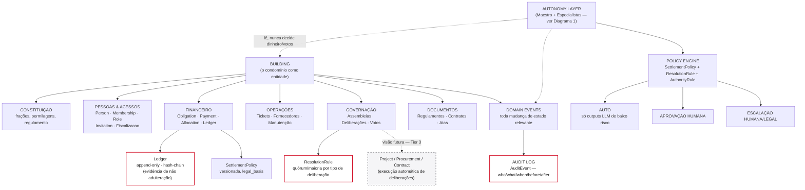
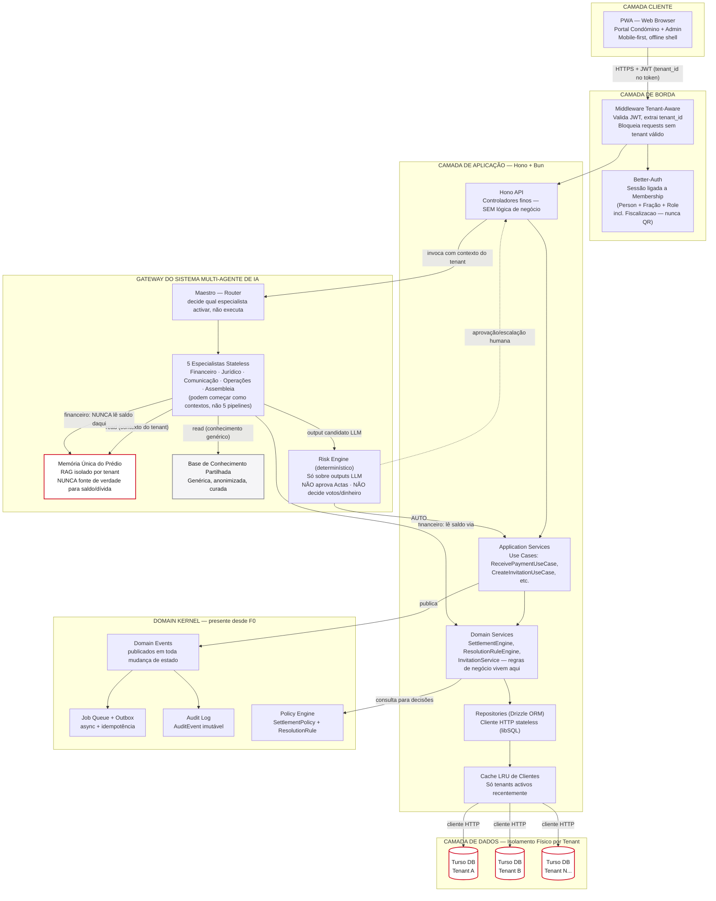
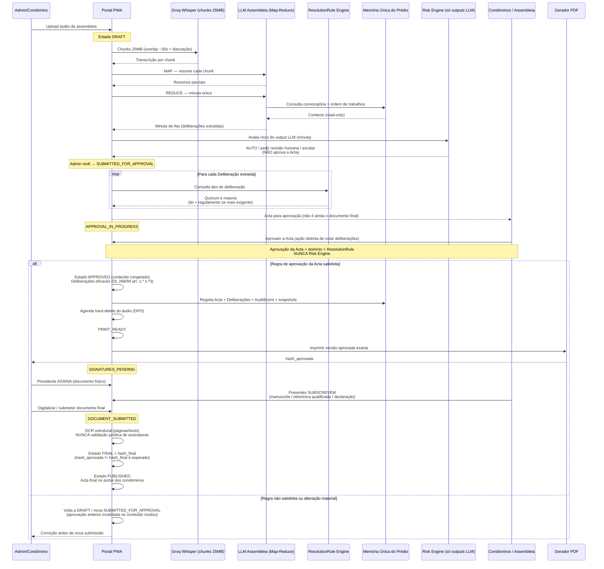
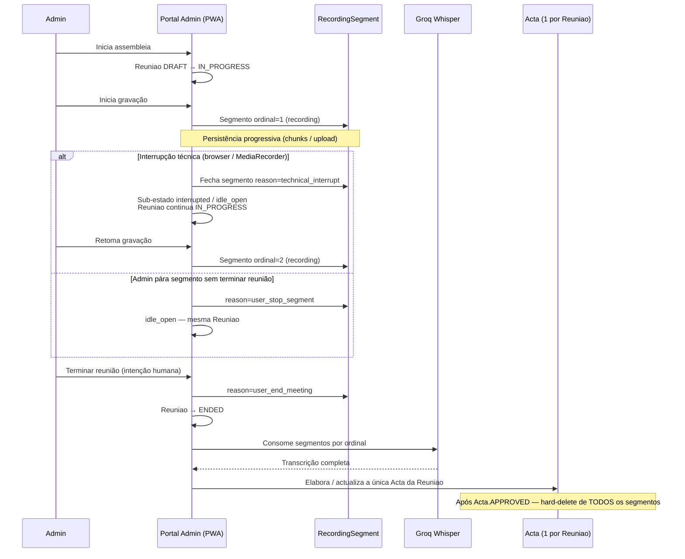
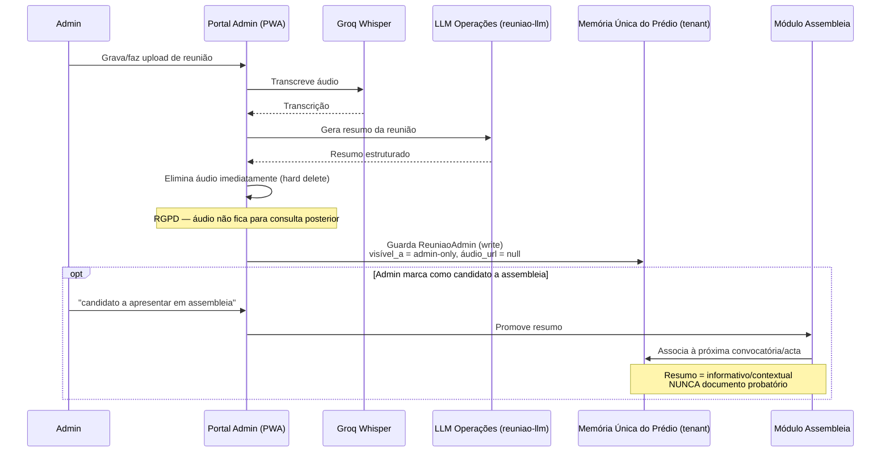
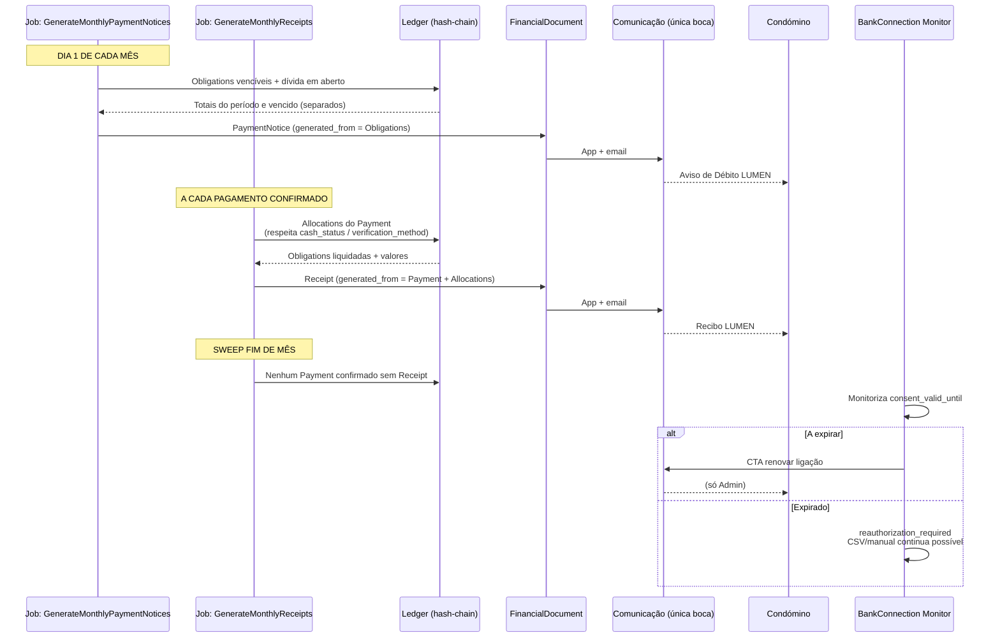
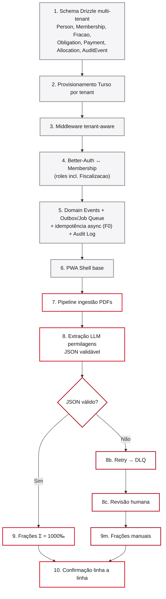

# LUMEN — Suíte de Diagramas de Arquitetura

> **Versão: v6.1 | Data: 2026-09-10 | Estado: ACEITE (consistency hardening)**

> **Nota complementar (v6.1):** sequência de gravação multi-segmento (`RecordingSegment`); nota convocatória ≠ comunicação de deliberações (art. 1432.º n.º 9).
>
> **Nota v6.1:** Diagrama 0 com `Fiscalizacao` e hash-chain no Ledger; Domain Kernel com Outbox/idempotência; onboarding com verificação de contacto (não identidade plena) e portal sem voto por defeito em F3; sequência Acta sem Risk Engine a aprovar (aprovação = condóminos/`ResolutionRule`); financeiro com `cash_status` / `verification_method`; roadmap com Pilot gate (pós-F3 Essencial) e General commercial gate (pós-F5 + Production Gates); IoT fora do comercial (Tier 3).
>
> Todos os blocos são Mermaid válido, prontos a colar no Miro.

---

## 0. Diagrama de Domínio (Framing Conceptual — "Building Digital Twin")

> Lente de organização do domínio, não lista de tarefas. Caixas tracejadas (`Autonomy Layer`, execução Tier 3) existem como visão; o esqueleto de Policy/Events vive desde F0.



**Responsabilidades diretas:** `Ledger` (com **hash-chain** como evidência de integridade / tamper evidence) e `AuditEvent` têm de estar corretos desde o dia 1. `Fiscalizacao` é role de segunda pessoa de controlo (ex.: confirmação de cash). `Project/Procurement/Contract` e IoT = Tier 3, fora do plano comercial. **Risk Engine / Policy Engine não aprovam Actas** — isso é governação + `ResolutionRule`.

---

## 1. Arquitetura Geral do Sistema (Visão Macro & Multi-tenancy)



**Responsabilidades diretas:**
- **Middleware Tenant-Aware** — único ponto de decisão de qual Turso DB; falha fechada.
- **Auth / Membership** — inclui role `Fiscalizacao`; nunca QR físico.
- **Domain Kernel** — Events + **Outbox/Job Queue com idempotência** + Audit + Policy desde F0.
- **Risk Engine** — só classifica outputs LLM; **não** aprova Actas nem substitui assembleia.
- **Memória Única** — nunca fonte de verdade financeira; finanças/governação independem do LLM.

---

## 2. Fluxo de Onboarding (Ingestão Admin + Ativação da Comunidade por Convite)

> **Sem QR físico.** **Sem envio automático de convites a partir de OCR sem confirmação do admin.**

```mermaid
flowchart TD
    subgraph F1["F1 — INGESTÃO ADMIN (Onboarding do Tenant)"]
        A1["Admin regista conta<br/>email, password, nome"] --> A2["Cria Person + Membership (role: Admin)"]
        A2 --> A3["Insere dados do condomínio<br/>morada, NIF, IBAN(s)"]
        A3 --> A4["Upload Regulamento Interno<br/>PDF ou foto"]
        A4 --> A5["LLM Jurídico extrai (consultivo):<br/>permilagens · regras · penalizações"]
        A5 --> A6["Admin confirma LINHA A LINHA<br/>(excerto do PDF visível por fração)"]
        A6 --> A7["Frações criadas automaticamente<br/>Σ permilagens = 1000‰"]
        A7 --> A8["Upload contactos proprietários<br/>PDF/Excel/foto ou manual"]
        A8 --> A8p["Tabela de pré-visualização<br/>(fração ↔ pessoa ↔ contacto)"]
        A8p --> A8c["Admin confirma/corrige<br/>NUNCA envio automático a partir do OCR"]
        A8c --> A9["Upload comprovativo IBAN"]
        A9 --> A9b["Liga Enable Banking (opcional)<br/>BankConnection à CONTA do condomínio"]
        A9b --> A10["Orçamento anual por rubrica<br/>Quota / FCR / Extraordinária"]
        A10 --> A11(["Tenant pronto<br/>Obligations calculadas"])
    end

    subgraph F3["F3 — ATIVAÇÃO DA COMUNIDADE (Convite em lote)"]
        C1["Botão explícito:<br/>'Enviar N Convites'"] --> C2["Invitations criadas em lote<br/>(mesmo lote_id) — individuais,<br/>privadas, uso único, revogáveis"]
        C2 --> B3["Sistema envia link único<br/>por email/SMS a cada contacto"]
        B3 --> B4["Destinatário abre o link<br/>no seu próprio dispositivo"]
        B4 --> B5["Verificação de CONTACTO<br/>(código/link recebido)<br/>NÃO é prova plena de identidade civil"]
        B5 --> B6{"Conta já<br/>existe?"}
        B6 -->|"Sim"| B7["Associa a conta existente"]
        B6 -->|"Não"| B8["Cria conta nova"]
        B7 --> B9["Membership criado<br/>Person + Fracao + Role"]
        B8 --> B9
        B9 --> B10["Sessão autenticada (better-auth)"]
        B10 --> B11(["Portal do Condómino — F3 default<br/>saldo · avisos · recibos · tickets<br/>SEM votação"])
        B11 -.->|"F5 + Production Gates"| B11v["Votação / assembleia<br/>habilitada"]
        B11 -.->|"ações sensíveis"| B12["Step-up: confirmação extra<br/>(alterar IBAN/titular; votar quando F5)"]
        C2 -.-> D1["Painel de Ativação<br/>convidados · contas · abriram portal"]
    end

    A8c -.->|"convite individual a qualquer momento"| C1
    A11 -.->|"tenant pronto habilita envio em lote"| C1

    classDef done fill:#D9E8D3,stroke:#5A7A4F,color:#1a1a1a
    classDef gate fill:#FFFFFF,stroke:#D0021B,color:#1a1a1a,stroke-width:2px
    class A11,B11 done
    class A8c,C1,B11v gate
```



**Responsabilidades diretas:**
- F1 termina com `Obligation`s calculadas.
- Confirmação antes do envio em lote = gate obrigatório.
- **Verificação de contacto ≠ identidade civil plena** — o link prova controlo do canal, não BI/Cartão de Cidadão.
- **Portal F3 por defeito sem votação**; votação só com F5 + [PRODUCTION-GATES](PRODUCTION-GATES.md).
- `BankConnection` ligada à conta do condomínio, não ao admin.

---

## 3. Diagramas de Sequência por Fluxo de Domínio

### 3.1 Processamento de Atas (F5) — aprovação pelos condóminos / ResolutionRule

> O Risk Engine **só** avalia outputs LLM (ex.: risco da minuta). **Não** emite o estado `APPROVED` da Acta.



### 3.1b Gravação multi-segmento (Assembleia — complemento v6.1)

> **Nota:** convocatória (`ConvocationDispatch`) ≠ comunicação das deliberações aos ausentes (`DeliberationNoticeDispatch`, art. 1432.º n.º 9). Falha técnica de MediaRecorder **nunca** põe a `Reuniao` em `ENDED`.



### 3.2 Reuniões Admin (F4.1)



### 3.3 Financeiro — Reconciliação e Alocação (F2)

```mermaid
sequenceDiagram
    participant Banco as Enable Banking / CSV
    participant Sync as Módulo Sync
    participant Engine as Engine de Reconciliação
    participant Matrix as Matriz de Identidade
    participant LLM as LLM Fallback (Financeiro)
    participant Settle as Settlement Engine
    participant Policy as SettlementPolicy (vigente)
    participant Ledger as Ledger (append-only + hash-chain)
    participant Recibo as Gerador de Recibo PDF
    participant Period as AccountingPeriod
    participant Fiscal as Fiscalizacao / Admin
    participant Admin

    Banco->>Sync: Movimentos bancários (sync ou CSV)
    Sync->>Engine: Novo MovimentoBancario
    Engine->>Matrix: Match determinístico<br/>(IBAN, nome, alias, valor)

    alt Match directo — confiança alta
        Matrix-->>Engine: Fração identificada
    else Sem match directo
        Engine->>LLM: Fallback — identificação provável
        LLM-->>Engine: Fração provável + confiança
        Note over LLM: LLM sugere; NUNCA decide alocação final sozinho
    end

    alt Confiança suficiente (transferência/banco)
        Engine->>Settle: Payment candidato<br/>verification_method = bank_match / deterministic
        Settle->>Policy: Ordem de imputação vigente
        Policy-->>Settle: Regras de SettlementPolicy
        Settle->>Settle: Aloca contra Obligations
        Settle->>Ledger: Allocation(s) append-only<br/>cada entrada liga hash da anterior (hash-chain)
        Ledger-->>Settle: Confirmado
        Settle->>Recibo: Receipt a partir das Allocations
        Recibo-->>Admin: Recibo app + email
    else Pagamento em dinheiro (cash)
        Engine->>Settle: Payment cash_status = registered<br/>(verification_method ainda vazio)
        Note over Settle: NÃO liquida Obligation de forma definitiva em registered
        alt second_person (Fiscalizacao)
            Fiscal->>Settle: Confirma (≠ quem registou)
            Settle->>Settle: cash_status = verified<br/>verification_method = second_person
            Note over Settle: deposited quando o depósito bancário reconciliar
        else bank_deposit (sem Fiscalizacao ou por escolha)
            Banco->>Settle: Movimento de depósito reconciliado
            Settle->>Settle: cash_status = verified então deposited<br/>verification_method = bank_deposit
        end
        Settle->>Ledger: Allocation definitiva só após verified<br/>(preferível deposited) + hash-chain
    else Confiança insuficiente
        Engine-->>Admin: Payment não_alocado_pendente
        Admin->>Settle: Confirmação manual
        Settle->>Ledger: Allocation + hash-chain
    end

    Note over Period: Fecho de mês:
    Period->>Ledger: Allocations do período (Ledger → Period)
    Period-->>Admin: Posted · Pending · Adjustments (três blocos)
```

### 3.4 Documentos Financeiros Mensais (F2) — Aviso de Débito + Recibo



---

## 4. Estrutura de Implementação por Fases (Roadmap F0–F6)

```mermaid
flowchart LR
    subgraph F0["F0 — PLATAFORMA + DOMAIN KERNEL"]
        F0a["Multi-tenancy Turso"]
        F0f["TenantDirectory"]
        F0b["Person + Membership<br/>+ Fiscalizacao"]
        F0d["Domain Services"]
        F0e["Events + Outbox/Jobs<br/>idempotência + Audit + Policy"]
    end

    subgraph F1["F1 — INGESTÃO + CONSTITUIÇÃO"]
        F1a["Upload regulamento"]
        F1b["Extração LLM + confirmação"]
        F1c["Frações + Obligations"]
    end

    subgraph F2["F2 — FINANCEIRO (LEDGER)"]
        F2a["Reconciliação + cash_status"]
        F2e["BankConnection"]
        F2c["Ledger hash-chain"]
        F2f["FinancialDocument"]
    end

    subgraph F3["F3 — COMUNIDADE + PWA"]
        F3a["Convites + verificação de contacto"]
        F3b["Portal SEM voto (default)"]
    end

    subgraph GATE_P["PILOT GATE"]
        GP["Essencial vendável<br/>F0–F3 estáveis<br/>sem distribuição além do piloto<br/>até F0–F2 OK"]
    end

    subgraph F4["F4 — OPERAÇÕES"]
        F4a["Tickets + foto"]
        F4b["Orçamentos"]
        F4c["Reuniões Admin"]
    end

    subgraph F5["F5 — ASSEMBLEIA"]
        F5a["STT + Atas"]
        F5b["ResolutionRule + votos"]
    end

    subgraph GATE_G["GENERAL COMMERCIAL GATE"]
        GG["F5 + Production Gates<br/>Profissional · atas/votos<br/>Liability / Legal / DPO / …"]
    end

    subgraph F6["F6 — ORQUESTRA"]
        F6a["Maestro + contextos/especialistas"]
        F6b["Risk Engine só outputs LLM"]
        F6c["Enterprise = Orquestra+API<br/>IoT = Tier 3 Future"]
    end

    F0 --> F1
    F1 --> F2
    F1 -.->|"UI em paralelo"| F3
    F2 ==>|"release F3 só com F2 fiável"| F3
    F3 --> GATE_P
    GATE_P --> F4
    F4 --> F5
    F5 --> GATE_G
    GATE_G --> F6
    F2 -.-> F6
    F3 -.-> F6

    classDef bloqueante fill:#FFFFFF,stroke:#A80015,color:#1a1a1a,stroke-width:2px
    classDef gate fill:#D9E8D3,stroke:#5A7A4F,color:#1a1a1a,stroke-width:2px
    classDef paralelo fill:#F5F5F7,stroke:#8E8E93,color:#1a1a1a,stroke-width:2px
    class F0,F2,F4,F5 bloqueante
    class GATE_P,GATE_G gate
    class F3 paralelo
```



**Regras:** Domain Kernel (incl. **async outbox + idempotência**) em F0. **Pilot gate** após F3 = oferta Essencial; sem distribuição além do piloto até F0–F2 estáveis (ver 07). **General commercial gate** após F5 + [PRODUCTION-GATES](PRODUCTION-GATES.md). F6 / Enterprise depois; IoT não entra no comercial.

---

## 5. Backlog de Ação Imediata (F0 e F1)



### Detalhe por tarefa

| # | Tarefa | Fase | Critério de aceitação | Nota |
|---|--------|------|------------------------|------|
| 1 | Schema Drizzle multi-tenant | F0 | Sem `quota.pago` boolean; modelo Obligation/Payment/Allocation | |
| 2 | Provisionamento Turso | F0 | `createTenantDB` idempotente | Isolamento físico |
| 3 | Middleware tenant-aware | F0 | Sem JWT válido → nunca chega a negócio | |
| 4 | Better-Auth ↔ Membership | F0 | Roles extensíveis incl. `Fiscalizacao` | |
| 5 | Events + **Outbox/Jobs com idempotência** + Audit | F0 | Job duplicado sem efeito duplicado; evento de teste no log | Async nascido em F0 |
| 6 | PWA Shell | F0 | Navegável, rotas por role | |
| 7 | Pipeline PDFs | F1 | Upload ≠ processamento; re-executável | |
| 8 | Extração LLM + DLQ | F1 | JSON validável; falha → revisão humana | |
| 9 | Frações automáticas | F1 | Σ permilagens = 1000‰ | |
| 10 | Confirmação linha a linha | F1 | Nada definitivo sem revisão com excerto PDF | |
